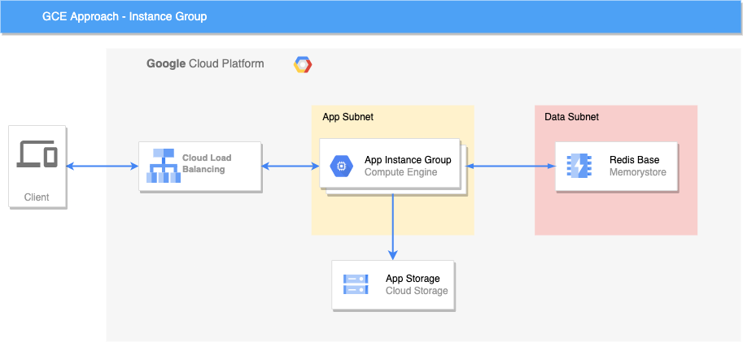

# GCE Solution
This solution use pure GCE approach and the application run direct in a **Managed Instance Group**

## Topology of Solution
The infrastructure is composed mainly by the following resources:

- A VPC with a subnet for run the instances ([network.tf](terraform/network.tf))
- A bucket to store the application executable ([build-app.tf](terraform/build-app.tf))
- A redis to store data ([redis.tf](terraform/redis.tf))
- A instance template, group manager, auto scaling and load balance for run the appplication ([gce.tf](terraform/gce.tf))



## Pre-requisites
For run this solition you must to have [terraform](https://www.terraform.io/) and [gcloud cli](https://cloud.google.com/sdk/docs/install) and then run the [setup.sh](setup.sh)


```bash
export TF_VAR_project_id=<Your Project Id>
./setup.sh
```

## Running the code
```bash
export TF_VAR_project_id=<Your Project Id>
terraform init
terraform apply
```