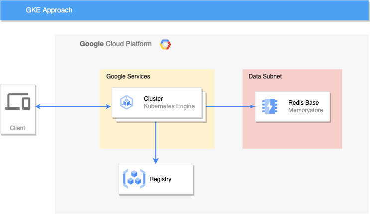

# GKE Solution
This solution uses the GKE approach and the application run directly from a container

## Topology of Solution
The infrastructure is mainly composed by the following resources:

- A VPC with a subnet for running the instances ([network.tf](terraform/network.tf))
- A Google Cloud Artifacts repository for storing the application container image ([build-app.tf](terraform/build-app.tf))
- A redis instance to store data ([redis.tf](terraform/redis.tf))
- A Kubernetes deployment, service, secret, and load balancer for running the appplication ([gke.tf](terraform/gke.tf))



## Pre-requisites
For run this solition you must to have [terraform](https://www.terraform.io/) and [gcloud cli](https://cloud.google.com/sdk/docs/install) and then run the [setup.sh](setup.sh)

## Running the code
```bash
export TF_VAR_project_id=<Your Project Id>
terraform init
terraform apply
```
