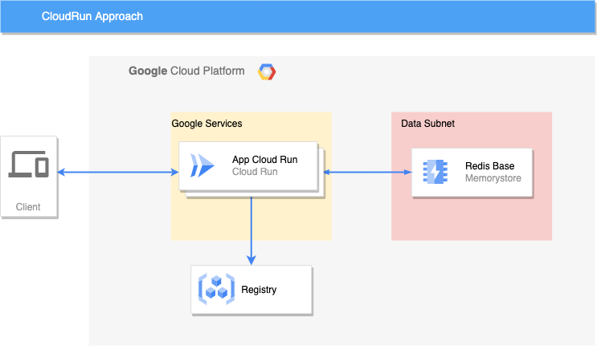

# CloudRun Solution
This solution use CloudRun approach and the application run as a service

## Topology of Solution
The infrastructure is composed mainly by the following resources:

- A redis to store data ([redis.tf](terraform/redis.tf))
- A VPC with a subnet for connect redis and service ([network.tf](terraform/network.tf))
- A run cloud run service for run the appplication ([gce.tf](terraform/cloudrun.tf))



## Pre-requisites
For run this solition you must to have [terraform](https://www.terraform.io/) and [gcloud cli](https://cloud.google.com/sdk/docs/install) and then run the [setup.sh](setup.sh)

```bash
export TF_VAR_project_id=<Your Project Id>
./setup.sh
```

## Running the code
```bash
export TF_VAR_project_id=<Your Project Id>
terraform init
terraform apply
```